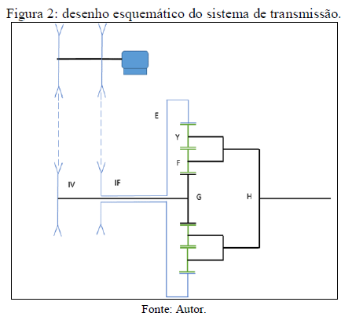
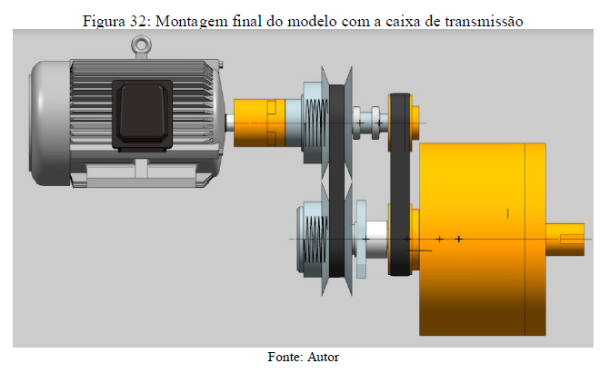

# Projeto-de-um-redutor-CVT

 
OBJETIVOS DO TRABALHO
Este trabalho tem por objetivo idealizar, dimensionar e desenhar um mecanismo de redução CVT para aplicação de calandras de máquinas têxteis, seguindo as especificações abaixo:

a) Acionamento do sistema através de um motor elétrico de corrente alternada de torque normal, com potência mínima de 10 kW.;

b) Utilização de polias de diâmetro variável em paralelo a um estágio de transmissão por polias fixas, com relação de transmissão total variando de 1 a 10;

c) Utilização de um estágio de transmissão planetária com engrenagens cilíndricas de dentes retos;

d) Relação de transmissão da polia variável entre 1/3 e 3;

e) Aplicação em calandras de máquinas têxteis, operando 6 horas por dia.
Com base nestas restrições, todo o sistema foi dimensionado para atender as especificações, partindo desde a escolha da rotação e potência do motor elétrico até o dimensionamento do epicicloidal.

 
  
 
    
    
    
    

CONCLUSÕES
    
Durante o desenvolvimento do mecanismo de transmissão CVT encontramos inúmeros obstáculos devido às restrições impostas para a construção do projeto: faixa de variação de transmissão, sistema de transmissão em paralelo, com dois tipos de polias (uma variável e uma fixa), e mínima recirculação de potência possível. Inicialmente o impasse foi na escolha de um layout que atendesse as condições iniciais do projeto, porém a cada novo modelo testado (cálculos teóricos) o sistema apresentava exorbitantes valores de recirculação. Após a determinação do layout e já tendo dimensionado parte dos elementos de transmissão (engrenagens e polias fixas) o contratempo passou ser o dimensionamento das polias variáveis (CVT), que por conta da alta rotação e potência existente nos eixos impossibilitou o uso direto dos catálogos da Gates, por esse motivo optou-se pelo dimensionamento de uma correia especial, a partir do catálogo da Gates, aumentando a largura para atender a necessidade da CVT. Entretanto verificamos que a correia dimensionada não transmite a potência necessária para atendermos a faixa de variação de transmissão. Com isso o dimensionamento do eixo foi afetado, pois a geometria do eixo esta diretamente relacionada aos esforços críticos transmitidos pelos elementos de transmissão. Contudo este trabalho possibilitou um grande acréscimo de conhecimento na área de projetos, de dimensionamento e escolha de componentes.Um estudo mais aprofundado sobre o dimensionamento das CVT pode acarretar em diferentes soluções que as propostas neste trabalho, trazendo desta forma, melhorias e novidades para o projeto. Por exemplo, a utilização de correias específicas para polias variáveis poderiam ter eliminado as dificuldades na construção do eixo. Por fim, é possível também um aprimoramento da configuração proposta do sistema, permitindo a redução da recirculação.
